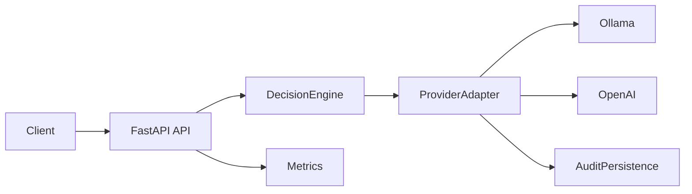

# Architecture (V1)

## Purpose
Define the technical architecture for V1 so humans and AI agents can implement consistently, keep interfaces stable, and avoid scope drift.

## System Goal
Build a local-first AI gateway that routes requests deterministically between local and cloud providers, records auditable outcomes, and exposes baseline metrics.

## High-Level Flow

## Core Components
- `API Layer`: Exposes `/v1/health`, `/v1/chat`, `/v1/metrics` (`/v1/routes` deferred).
- `DecisionEngine`: Produces deterministic routing decisions and explicit reason codes.
- `Providers`: Shared provider interface with `ollama` and `openai` adapters only in V1.
- `Audit`: Persists one audit event per chat request in Postgres (prompt hash and metadata only).
- `Telemetry`: Structured JSON logs and Prometheus-compatible metrics.

## Request Lifecycle (`/v1/chat`)
1. API receives validated request schema.
2. DecisionEngine evaluates cost/sensitivity policy from config.
3. DecisionEngine returns target provider + reason codes.
4. Provider adapter executes request.
5. Audit event is persisted (including decision/status/latency/failure category).
6. Metrics counters and latency histograms are updated.
7. API responds with provider, reason codes, and model response payload.

## Determinism Rules
- Same input + same config must produce the same routing decision.
- Every decision must include explicit reason codes.
- Policy thresholds and sensitivity terms must be config-driven, not hard-coded.

## Data Handling and Security
- Never persist raw prompts by default.
- Persist prompt hash, prompt length, and metadata flags only.
- Secrets must come from environment variables and must be redacted from logs.
- Test fixtures must not contain PII.
- Audit events are persisted in Postgres for V1 durability and queryability.

## API Contract Stability
- Public schemas are stable contracts.
- Any public schema change requires:
  - test updates,
  - `README.md` updates,
  - this document (`docs/ARCHITECTURE.md`) updates.

## Testing Strategy (V1)
- Decision logic: unit tests for sensitive/cost/default branches and determinism.
- Provider behavior: integration tests with mocked HTTP.
- Request flow: integration tests for route behavior, fallback behavior, and audit writes.
- No real network calls in tests.

## V1 Boundaries
- In scope: local/openai routing, audit persistence (Postgres), metrics, API with OpenAPI docs (`/docs`). CLI and simple UI deferred.
- Out of scope: RAG/vector DB, multi-tenant auth, additional providers, fancy UI, agent workflows.

## V2 / M2 (Draft): Operator UX Slice
The following items are planned for the next milestone (M2) and are tracked in `.context/TASKS.md`:

- **T-201**: Add `request_id` to the `/v1/chat` response and add `GET /v1/audit/{request_id}` to fetch the corresponding audit event (safe fields only; no raw prompt).
- **T-202**: Add `GET /v1/routes` that returns a safe view of the effective policy (rule order, cost threshold(s), sensitivity configuration summary, default provider).
- **T-204**: Add “easy-mode” USD cost threshold routing using a chars→tokens heuristic and an env-configured OpenAI input price (no tokenization dependencies). When unset, fall back to the existing character-threshold behavior.
- **T-203**: Add a minimal **static HTML/JS** UI (no Python in the frontend) served by FastAPI that can: chat (`/v1/chat`), show rules (`/v1/routes`), and fetch audit for the last request (`/v1/audit/{request_id}`).

### V2 Interface Additions (Draft)
- `/v1/chat` response includes `request_id` (and optionally `X-Request-Id` header).
- New: `GET /v1/audit/{request_id}`
- New: `GET /v1/routes`
- New: UI served at `/` or `/ui` via mounted static files (implementation details tracked in T-203).

## Implementation Notes
- Use `docs/STRUCTURE.md` for file and module placement.
- Use `.context/TASKS.md` + `.context/private/tasks/` as execution source of truth.
