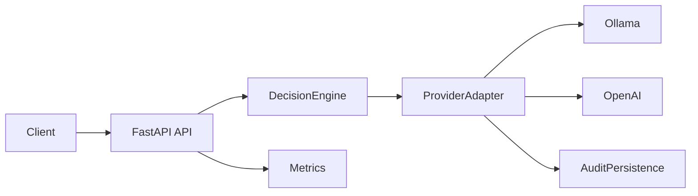

# Architecture (V1)

## Purpose
Define the technical architecture for V1 so humans and AI agents can implement consistently, keep interfaces stable, and avoid scope drift.

## System Goal
Build a local-first AI gateway that routes requests deterministically between local and cloud providers, records auditable outcomes, and exposes baseline metrics.

## Technology stack

| Layer | Technology | Role |
|-------|------------|------|
| **Runtime** | Python 3.11+ | Application and tests |
| **Web framework** | FastAPI | API, OpenAPI docs, static file serving |
| **ASGI server** | Uvicorn | Serves the FastAPI app (in process or container) |
| **Database** | PostgreSQL 16 | Audit event persistence |
| **ORM / migrations** | SQLAlchemy, Alembic | Schema and migrations |
| **DB driver** | psycopg (async) | Postgres connectivity |
| **HTTP client** | httpx | Calls to Ollama and OpenAI APIs |
| **Metrics** | prometheus_client | Counters and histograms at `/v1/metrics` |
| **Local LLM** | Ollama | Optional; runs as a container or on host |
| **Cloud LLM** | OpenAI API | Optional; requires API key |
| **Containers** | Docker, Docker Compose | Postgres, app, and optionally Ollama; see [GETTING_STARTED](GETTING_STARTED.md) |

The app can run **in Docker** (recommended: `docker compose up`) or **on the host** (Postgres elsewhere, `uvicorn app.main:app`). Config is via environment variables (see [.env.example](../.env.example)).

## High-Level Flow

## Core Components
- `API Layer`: Exposes `/v1/health`, `/v1/chat`, `/v1/metrics`, `/v1/routes`, `/v1/audit/{request_id}`.
- `DecisionEngine`: Produces deterministic routing decisions and explicit reason codes.
- `Providers`: Shared provider interface with `ollama` and `openai` adapters.
- `Audit`: Persists one audit event per chat request in Postgres (prompt hash and metadata only).
- `Telemetry`: Structured JSON logs and Prometheus-compatible metrics.
- `UI`: Minimal static HTML/JS at `/` and `/ui` (chat, rules, audit).

## Request Lifecycle (`/v1/chat`)
1. API receives validated request schema.
2. DecisionEngine evaluates cost/sensitivity policy from config.
3. DecisionEngine returns target provider + reason codes.
4. Provider adapter executes request.
5. Audit event is persisted (including decision/status/latency/failure category).
6. Metrics counters and latency histograms are updated.
7. API responds with provider, reason codes, and model response payload.

## Determinism Rules
- Same input + same config must produce the same routing decision.
- Every decision must include explicit reason codes.
- Policy thresholds and sensitivity terms must be config-driven, not hard-coded.

## Data Handling and Security
- Never persist raw prompts by default.
- Persist prompt hash, prompt length, and metadata flags only.
- Secrets must come from environment variables and must be redacted from logs.
- Test fixtures must not contain PII.
- Audit events are persisted in Postgres for V1 durability and queryability.

## API Contract Stability
- Public schemas are stable contracts.
- Any public schema change requires:
  - test updates,
  - `README.md` updates,
  - this document (`docs/ARCHITECTURE.md`) updates.

## Testing Strategy (V1)
- Decision logic: unit tests for sensitive/cost/default branches and determinism.
- Provider behavior: integration tests with mocked HTTP.
- Request flow: integration tests for route behavior, fallback behavior, and audit writes.
- No real network calls in tests.

## Boundaries
- **In scope:** local/openai routing, audit persistence (Postgres), metrics, API with OpenAPI docs (`/docs`), `/v1/routes`, `/v1/audit/{request_id}`, minimal static UI at `/` and `/ui`. See `.context/SCOPE.md` for the canonical scope list.
- **Out of scope:** RAG/vector DB, multi-tenant auth, additional providers, fancy UI, agent workflows.

M1 (vertical slice) and M2 (operator UX: request_id, audit fetch, `/v1/routes`, USD cost rule, minimal UI) are implemented. Current interfaces:

## M2 Interfaces (Implemented)

- `/v1/chat` returns `request_id` and sets `X-Request-Id` header.
- `GET /v1/audit/{request_id}` returns the audit event (safe fields only).
- `GET /v1/routes` returns the effective policy (no secrets).
- UI at `/` and `/ui` (static HTML/JS) for chat, rules, and audit.

## Implementation Notes
- Use `docs/STRUCTURE.md` for file and module placement.
- Use `.context/TASKS.md` + `.context/private/tasks/` as execution source of truth.
